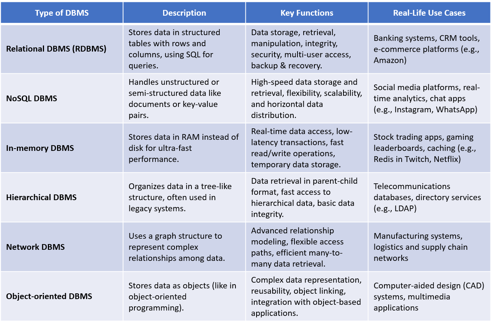

## Understanding Database Management Systems (DBMS)

Database Management Systems (DBMS) are essential software tools that power most digital applications by efficiently storing, organizing, and managing data. They're like advanced digital filing systems that support everything from app logins to online purchases.

## Key Functions of a DBMS

- **Data Management**: Organizes, stores, retrieves, and modifies data efficiently using structured formats and queries.

- **Security & Integrity**: Ensures data is protected, accurate, and consistent through access controls and validation rules.

- **Multi-user Support**: Allows simultaneous access and collaboration without data conflicts.

- **Backup & Recovery**: Automates data backups and enables quick recovery during system failures.

## Types of Database Management Systems

